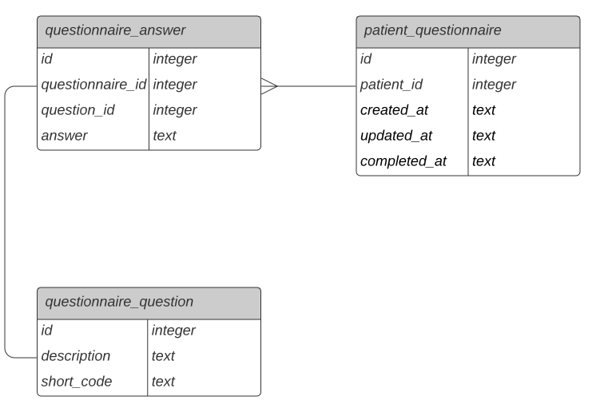

## Getting Started

### Requirements

- Git
- Node
- Yarn or npm

### Running the app

```
npm i && npm run start
```

### Running the tests

```
npm i && npm run test
```

### Data Model



## Requirements

- Design a REST or GraphQL API that allows retrieving the following properties for a patient:
  - Date of birth
  - First name
  - Last name
  - Allergies
  - Medications
- Integrate the API with the SQLite database in `./questionnaire.db`
- Handle multiple answers from the same patient for the same question on different dates
  - This requirement is purposefully vague, as we are curious to see how you approach this task, and what assumptions you choose to make

## Tips

We'll be looking for:

- A well-defined and extensible API schema.
- A well-designed and secure implementation.
- Production quality code.
- Clearly communicated assumptions.
- Useful and well structured tests.
- A functionally correct solution (we'll be running some tests using the sample data).
